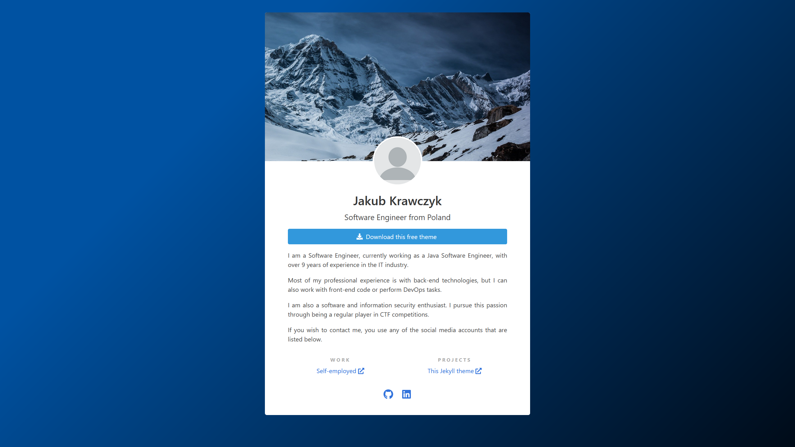

Jekyll Profile Page
===================

This is a simple Jekyll theme for building profile pages.

**!!! Disclaimer: This is a Work In Progress version !!!**

## Table of Contents

- [Jekyll Profile Page](#jekyll-profile-page)
  - [Table of Contents](#table-of-contents)
    - [GitHub Pages usage](#github-pages-usage)
    - [Screenshot](#screenshot)
    - [Theme settings](#theme-settings)
    - [TODO](#todo)
    - [License](#license)

### GitHub Pages usage

If you wish to use this theme in GitHub Pages, you need to specify `main` branch in order to get the newest version:

```yaml
remote_theme: fnyu/jekyll-profile-page@main
```

### Screenshot



### Theme settings

```yaml
# Theme-specific settings
cover_photo:
  url: assets/images/cover.jpg
  alt: "Mountains covered with snow and dark sky in the background"

profile_picture: assets/images/photo.png

author:
  name: "Your name"
  occupation: "Your occupation"
  # Location is optional
  location:
    name: "City, Country"
    # If you don't provide the link, only text will be printed
    url: "https://<optional link to maps>/"

# Action button is optional
action_button:
  label: "Call to action button"
  icon: "fas fa-briefcase"

# Workplaces are optional
work:
  -
    name: "Workplace"
    url: "https://<workplace url>"

# Projects are optional
projects:
  -
    name: "This Jekyll theme"
    url: "https://github.com/fnyu/jekyll-profile-page"

# Social media are optional
# You can use any icon from Font Awesome Brands Pack
social:
  -
    url: "https://github.com/<username>"
    title: "GitHub Profile Page"
    icon: "fab fa-github"
```

### TODO

 * Add action support for action button
 * Add blogging capabilities
 * Add navigation

### License

This work is published under [MIT](https://github.com/fnyu/jekyll-profile-page/blob/master/LICENSE.txt) License.
